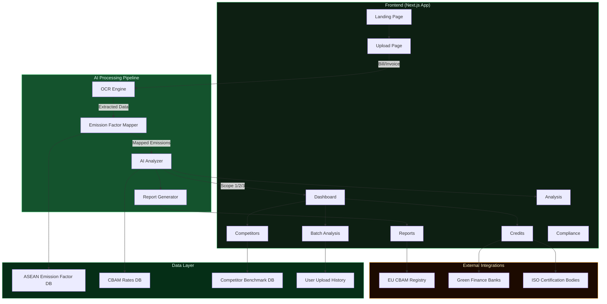
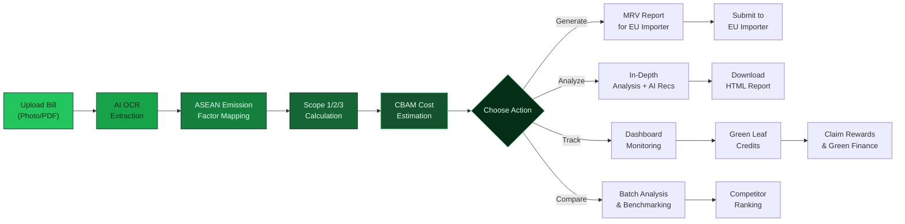
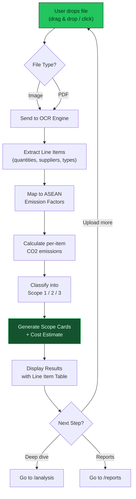
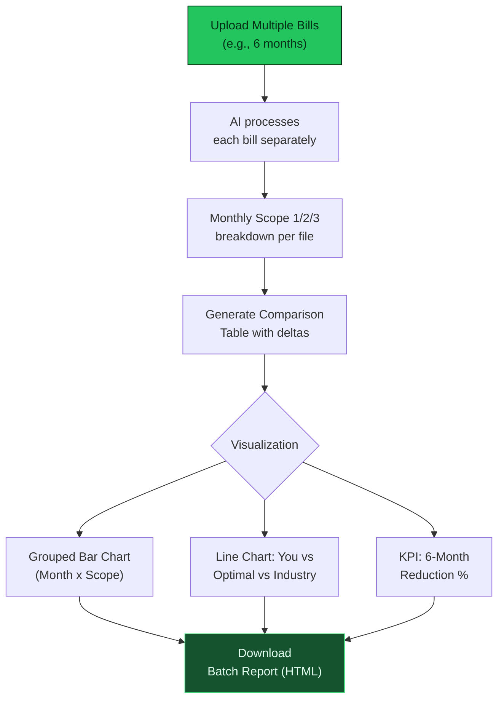
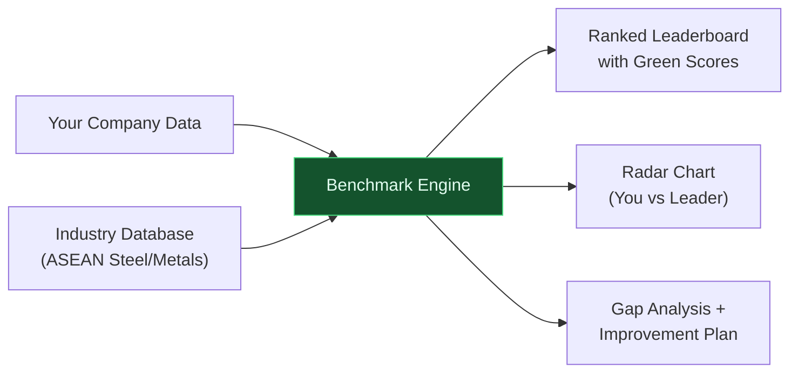
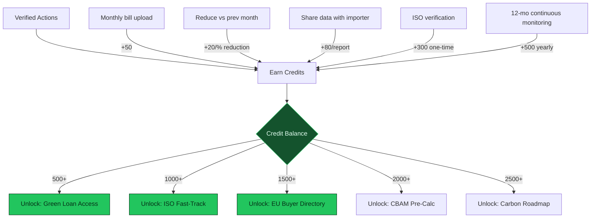
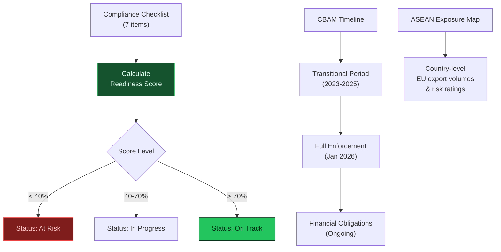
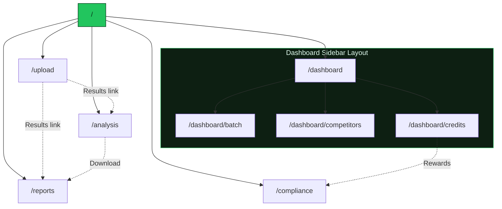
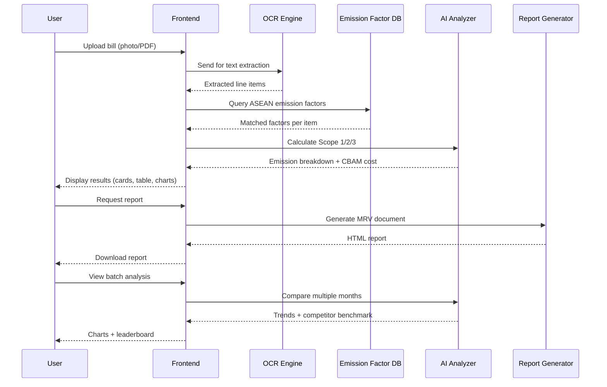

<p align="center">
  
</p>

<h1 align="center">FEDORA</h1>
<h3 align="center">The Climate Operating System for ASEAN SMEs</h3>

<p align="center">
  <em>Helping ASEAN manufacturers keep their EU market access as carbon border taxes go live in 2026.</em><br/>
  <em>Upload a bill, get your footprint, generate your CBAM report — under an hour.</em>
</p>

<p align="center">
  
  
  
  
  
</p>

---

## Table of Contents

- [Problem Statement](#problem-statement)
- [What is Fedora?](#what-is-fedora)
- [System Architecture](#system-architecture)
- [Core Workflow](#core-workflow)
- [Feature Deep Dive](#feature-deep-dive)
  - [Landing Page](#1-landing-page)
  - [Upload & AI Analysis](#2-upload--ai-analysis)
  - [Dashboard Overview](#3-dashboard-overview)
  - [Batch & Yearly Analysis](#4-batch--yearly-analysis)
  - [Competitor Benchmarking](#5-competitor-benchmarking)
  - [Green Leaf Credits](#6-green-leaf-credits)
  - [In-Depth Analysis](#7-in-depth-analysis)
  - [Reports Management](#8-reports-management)
  - [CBAM Compliance Tracker](#9-cbam-compliance-tracker)
- [Page Routing Map](#page-routing-map)
- [Data Flow Architecture](#data-flow-architecture)
- [Tech Stack](#tech-stack)
- [Getting Started](#getting-started)
- [Project Structure](#project-structure)
- [Contributing](#contributing)
- [License](#license)

---

## Problem Statement

The EU's **Carbon Border Adjustment Mechanism (CBAM)** goes into full enforcement in **January 2026**. ASEAN manufacturers exporting to the EU must now:

1. **Measure** embedded carbon emissions per unit of product
2. **Report** emissions using EU-approved MRV (Monitoring, Reporting, Verification) formats
3. **Pay** for CBAM certificates based on embedded emissions

**Without actual data**, EU importers use **default values** (worst-case carbon intensity), making ASEAN products up to **3x more expensive** than necessary and threatening supplier relationships.

> Most ASEAN SMEs lack the tools, expertise, and budget to comply. Fedora solves this.

---

## What is Fedora?

Fedora is a **Climate Operating System** that takes ASEAN SMEs from a **photo of an energy bill** to a **CBAM-compliant MRV report** in under an hour. No consultants. No European accounting tools. Built for the ASEAN factory floor.

```
Invoice Photo  -->  AI OCR  -->  Emission Mapping  -->  CBAM Report  -->  Green Finance
```

---

## System Architecture



---

## Core Workflow



---

## Feature Deep Dive

### 1. Landing Page

**Route:** `/`

A premium, animated hero section showcasing the Fedora platform with:

- **Animated SVG Background Paths** — flowing green path lines using Framer Motion
- **Floating Leaf Particles** — nature-themed SVG leaves with CSS animations
- **Letter-by-Letter Title Animation** — spring-animated "FEDORA" with green gradients
- **Cycling Subtitle** — rotating taglines that fade in/out
- **CBAM Alert Banner** — urgency-driven callout with enforcement date
- **GlowCard Feature Grid** — pointer-tracking spotlight cards for each feature
- **Before/After Comparison** — visual business impact of using Fedora
- **4-Step "How It Works"** — quick overview of the user journey
- **Stat Pills** — key metrics at a glance

---

### 2. Upload & AI Analysis

**Route:** `/upload`



**Features:**
- Drag-and-drop upload zone with file type support (PNG, PDF, JPG, HEIC)
- Simulated AI processing pipeline with visual progress steps
- Scope 1/2/3 emission cards with color-coded values
- Extracted line-item table showing per-item emission factors
- CBAM cost estimation panel
- Quick links to deeper analysis and report generation

---

### 3. Dashboard Overview

**Route:** `/dashboard`

The main analytics hub with a persistent **sidebar navigation** for all dashboard sub-features:

- **KPI Cards** — Total emissions, CBAM exposure, Green Supplier Score, month trend
- **SVG Donut Chart** — Scope 1/2/3 breakdown with legends
- **SVG Bar Chart** — Monthly emissions trend over 6 months
- **CBAM Exposure Panel** — Certificate cost and EU ETS price tracking
- **Recent Reports Table** — Quick access to latest generated reports

**Sidebar Navigation:**
| Section | Route | Description |
|---------|-------|-------------|
| Overview | `/dashboard` | KPIs + charts |
| Batch & Yearly | `/dashboard/batch` | Multi-month upload & comparison |
| Competitors | `/dashboard/competitors` | Sector benchmarking |
| Green Credits | `/dashboard/credits` | Credit system & rewards |
| Upload Bill | `/upload` | Quick link |
| Analysis | `/analysis` | Quick link |
| Reports | `/reports` | Quick link |
| Compliance | `/compliance` | Quick link |

---

### 4. Batch & Yearly Analysis

**Route:** `/dashboard/batch`



**Features:**
- Upload bills for multiple months at once
- File list table with per-month scope values and delta indicators
- **Grouped Bar Chart** — side-by-side Scope 1/2/3 + Total per month
- **Trajectory Line Chart** — your emissions vs optimal target vs industry average
- Reduction % KPI with AI insights
- Downloadable batch analysis HTML report

---

### 5. Competitor Benchmarking

**Route:** `/dashboard/competitors`



**Features:**
- **ASEAN Sector Leaderboard** — ranked table of competitors with Green Scores, emissions, and CBAM costs
- Medal indicators for top 3 positions
- Your position highlighted with gap-to-next-rank calculation
- **Radar Chart** — 6-axis comparison (Scope 1/2/3, Documentation, CBAM Cost, Green Score) vs the sector leader
- **Improvement Plan** — actionable items with estimated emission reduction and score boost
- Horizontal progress bars for visual score comparison

---

### 6. Green Leaf Credits

**Route:** `/dashboard/credits`



**Features:**
- **Credit Progress Ring** — animated SVG showing credits earned vs next tier
- Tier system: Member → Bronze → Silver → Gold → Platinum
- **Rewards Marketplace** — claimable rewards with credit cost, category, and lock states
- **How to Earn** checklist — actionable credit-earning activities with completion state
- **ASEAN Credits Leaderboard** — company rankings by credit balance with tier badges
- Claim functionality with visual feedback

---

### 7. In-Depth Analysis

**Route:** `/analysis`

**Features:**
- KPI summary cards (emissions, CBAM cost, supply chain ratio)
- Scope distribution ring charts with detailed breakdowns
- **CBAM Calculation Section** — step-by-step certificate cost derivation
- **Emission Breakdown Table** — per-source emissions with risk levels (High/Medium/Low)
- **AI Recommendations** — expandable decarbonisation suggestions with ROI estimates
- **Downloadable HTML Report** — full analysis with charts, styled for printing

---

### 8. Reports Management

**Route:** `/reports`

**Features:**
- Filter tabs: All, CBAM MRV, Scope 2, Supply Chain, Verification
- Report table with ID, type, date, CO2e, importer, and status
- Status badges: Ready (green), Processing (amber), Verified (blue)
- Download actions per report
- Guidance section on using reports for EU importers and green finance applications

---

### 9. CBAM Compliance Tracker

**Route:** `/compliance`



**Features:**
- **Readiness Score** — percentage-based compliance score with progress ring
- **Compliance Checklist** — 7-item actionable checklist with links to relevant pages
- **CBAM Timeline** — visual timeline from transitional to full enforcement
- **ASEAN Country Exposure Table** — per-country EU export volumes and risk ratings
- **Before/After Comparison** — business impact visualization of using Fedora

---

## Page Routing Map



---

## Data Flow Architecture



---

## Tech Stack

| Layer | Technology | Purpose |
|-------|-----------|---------|
| Framework | **Next.js 16** | SSR, routing, React 19 |
| Language | **TypeScript 5** | Type-safe development |
| Styling | **Tailwind CSS 4** | Utility-first CSS |
| Animation | **Framer Motion 11** | Page transitions, path animations |
| UI Components | **shadcn/ui** | Button, card primitives |
| Icons | **Lucide React** | Consistent iconography |
| Charts | **Custom SVG** | Donut, bar, line, radar, ring charts |
| Effects | **Custom Components** | BackgroundPaths, GlowCard, floating leaves |

---

## Getting Started

### Prerequisites

- Node.js 18+
- npm or yarn

### Installation

```bash
# Clone the repository
git clone https://github.com/Nathan-Jamesss/fedora-app.git
cd fedora-app

# Install dependencies
npm install --legacy-peer-deps

# Start the development server
npm run dev
```

Open [http://localhost:3000](http://localhost:3000) to see the app.

### Build for Production

```bash
npm run build
npm start
```

---

## Project Structure

```
fedora-app/
├── app/
│   ├── page.tsx                    # Landing page (animated hero)
│   ├── globals.css                 # Global styles + theme
│   ├── layout.tsx                  # Root layout
│   ├── upload/
│   │   └── page.tsx                # Upload & AI analysis
│   ├── dashboard/
│   │   ├── layout.tsx              # Sidebar navigation layout
│   │   ├── page.tsx                # Dashboard overview (KPIs + charts)
│   │   ├── batch/
│   │   │   └── page.tsx            # Batch & yearly analysis
│   │   ├── competitors/
│   │   │   └── page.tsx            # Competitor benchmarking
│   │   └── credits/
│   │       └── page.tsx            # Green Leaf Credits system
│   ├── analysis/
│   │   └── page.tsx                # In-depth emission analysis
│   ├── reports/
│   │   └── page.tsx                # Reports management
│   └── compliance/
│       └── page.tsx                # CBAM compliance tracker
├── components/
│   └── ui/
│       ├── button.tsx              # shadcn Button (green themed)
│       ├── hero-1.tsx              # Hero section component
│       ├── background-paths.tsx    # Animated SVG path background
│       └── spotlight-card.tsx      # Pointer-tracking glow card
├── lib/
│   └── utils.ts                    # cn() utility
├── package.json
├── tsconfig.json
└── tailwind.config.ts
```

---

## Contributing

1. Fork the repository
2. Create your feature branch (`git checkout -b feature/amazing-feature`)
3. Commit your changes (`git commit -m 'Add amazing feature'`)
4. Push to the branch (`git push origin feature/amazing-feature`)
5. Open a Pull Request

---

## License

This project is part of the **BU x Berkeley Climate Venture Competition 2026**.

---

<p align="center">
  <strong>FEDORA</strong> — The Climate OS for ASEAN SMEs<br/>
  <em>Measure. Report. Profit. Keep your EU market access.</em>
</p>
